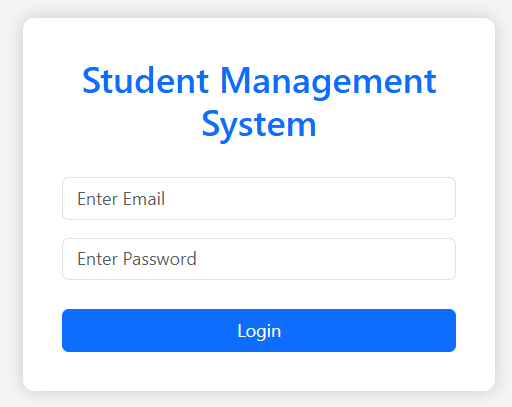
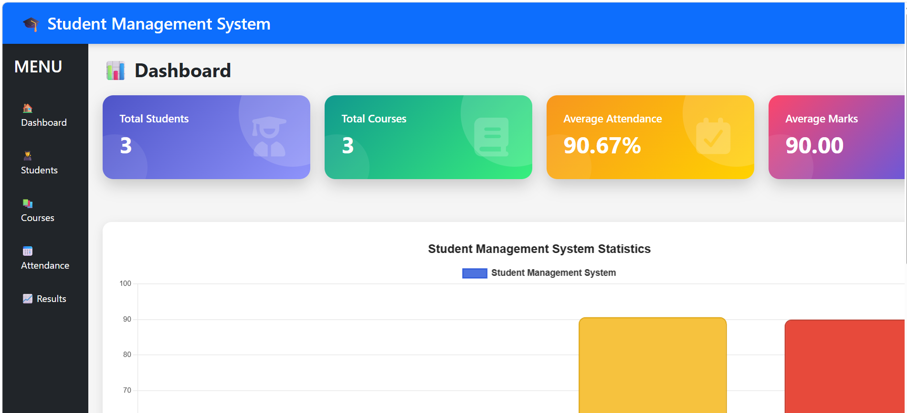
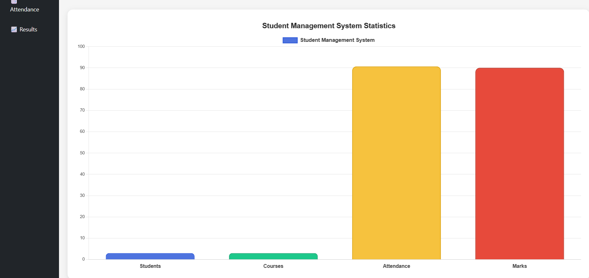
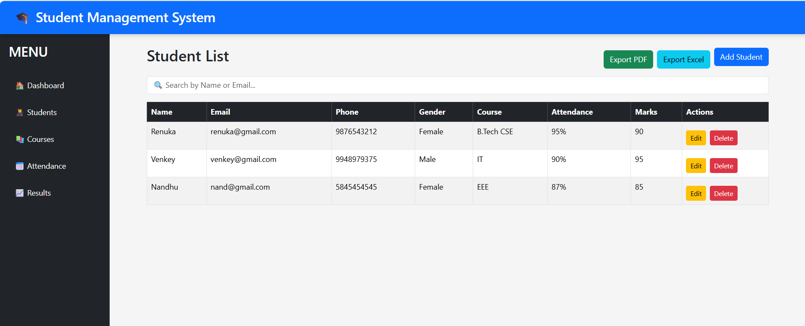
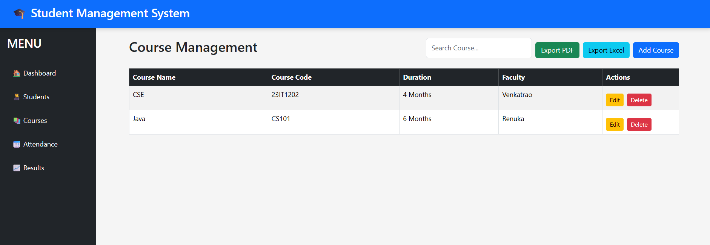
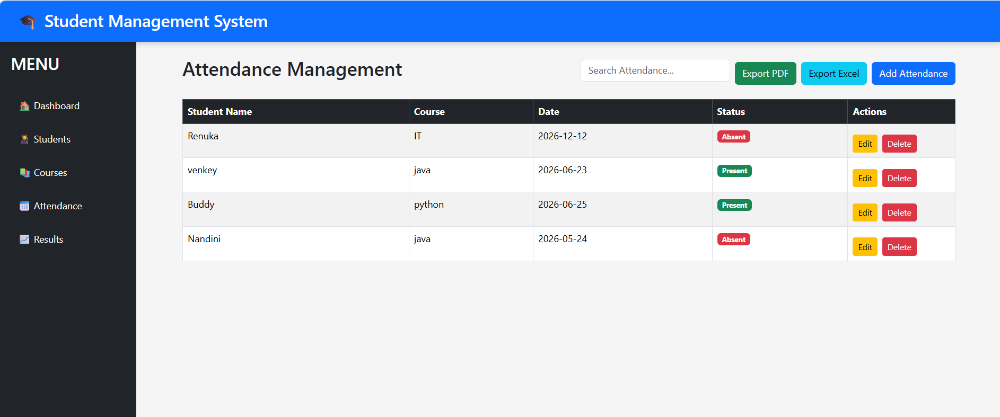
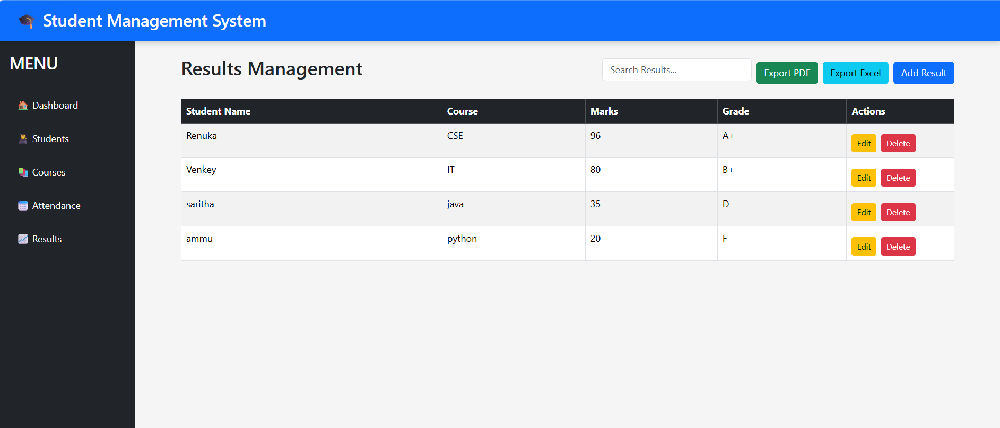

# Student Management System

## Description

Student Management System is a full-stack web application developed using the MERN Stack (MongoDB, Express.js, React.js, and Node.js). It allows users to manage students, courses, attendance, and examination results with complete CRUD operations, search functionality, dashboard statistics, and PDF/Excel export.

## Technologies Used

* React.js
* Node.js
* Express.js
* MongoDB
* Bootstrap
* Chart.js

## Project Screenshots

### Login

### Dashboard

### Student Management

### Course Management

### Attendance Management

### Results Management

## Developer

**Renuka**

GitHub: https://github.com/Renuka-9059
